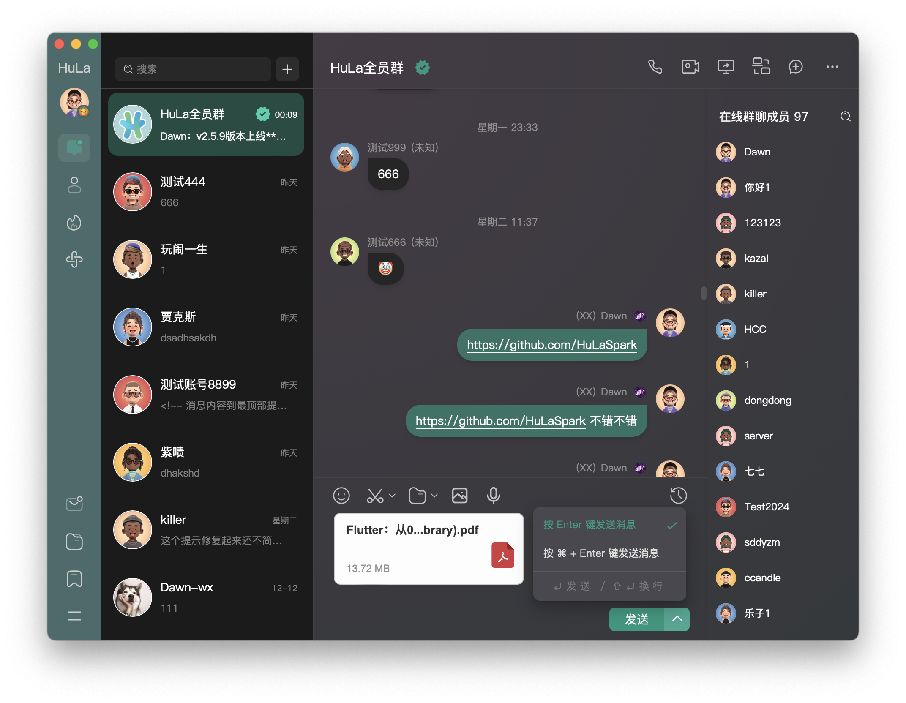
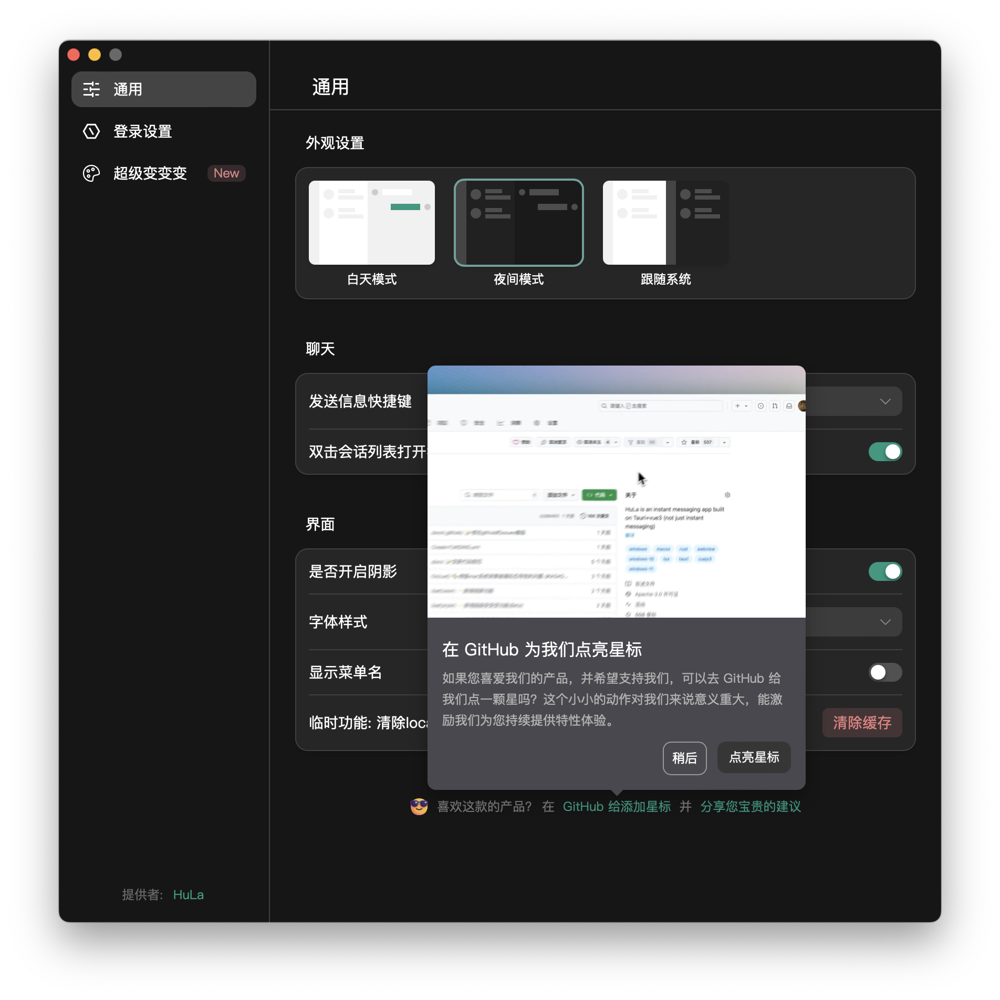
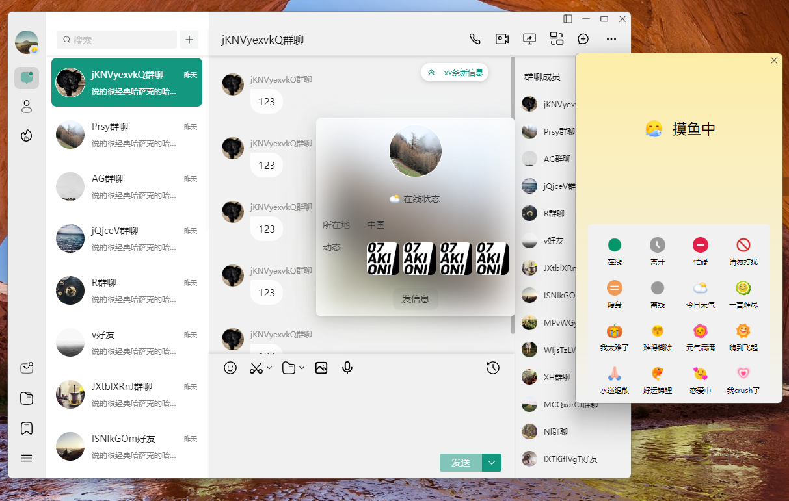
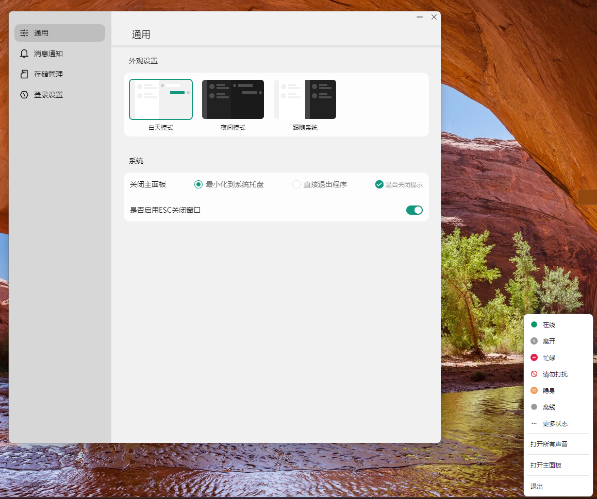

<p align="center">
  
</p>

<p align="center">An Instant Messaging System Built with Tauri, Vite 6, Vue 3, and TypeScript</p>

<div align="center">
  <a href="https://app.fossa.com/projects/git%2Bgithub.com%2FHuLaSpark%2FHuLa?ref=badge_shield"></a>
  <a href="https://www.bestpractices.dev/zh-CN/projects/9692"></a>
  
  
  
  
  
  
  
  
  
</div>

<p align="center">
  gitee：<a href="https://gitee.com/HulaSpark/HuLa/stargazers"></a>
  github：<a href="https://gitee.com/link?target=https://github.com/HulaSpark/HuLa/stargazers"></a>
  gitcode：<a href="https://gitcode.com/HuLaSpark/HuLa"></a>
</p>
<p align="center">
  WeChat: 
</p>

<p align="center">
  ☕️ server：<a href="https://github.com/HulaSpark/HuLa-Server">github HuLa-Server</a> | <a href="https://gitee.com/HulaSpark/HuLa-Server">gitee HuLa-Server</a>
</p>

<p align="center"><a href="README.zh-CN.md">中文</a> | English</p>

## Project Introduction

HuLa is an instant messaging system developed with Tauri, Vite 6, Vue 3, and TypeScript. It leverages the cross-platform capabilities of Tauri and the reactive design of Vue 3, combined with TypeScript's type safety features and the fast build system of Vite 6, to provide users with an efficient, secure, and easy-to-use communication solution.

## Technology Stack

- **Tauri**: Provides a lightweight, high-performance desktop application container, enabling the development of cross-platform desktop applications with a web technology stack. Tauri's design philosophy aims to minimize resource consumption while ensuring security.
- **Vite 6**: A modern front-end build tool that uses native ES module import to offer a fast development server. At the same time, it provides robust support for production builds. Vite 6 is its latest version, bringing more optimizations and features.
- **Vue 3**: A progressive JavaScript framework for building user interfaces. Its Composition API, improved TypeScript integration, and optimizations for mobile platforms make developing complex single-page applications simpler and more efficient.
- **TypeScript**: A superset of JavaScript that adds a type system to the language. It enables catching more errors during development and provides better support from editors.

## Project PreView






<div style="padding: 28px; display: inline-block;">
  
</div>

<div style="padding: 28px; display: inline-block;">
  
</div>

<div style="padding: 28px; display: inline-block;">
  
</div>

<div style="padding: 28px; display: inline-block;">
  
</div>

<div style="padding: 28px; display: inline-block;">
  
</div>

## ✨ Completed Features

| Feature Category | Feature Description | Status |
|-----------------|---------------------|--------|
| 🔐 **User Authentication** | Username/Password Login | ✅ Completed |
| | QR Code Scan Login | ✅ Completed |
| | Multi-device Login Management | ✅ Completed |
| 💬 **Messaging** | One-on-one Private Chat | ✅ Completed |
| | Group Chat | ✅ Completed |
| | Message Recall | ✅ Completed |
| | @Mention, Reply Function | ✅ Completed |
| | Message Read Status | ✅ Completed |
| | Emoji Function | ✅ Completed |
| | Context Menu Based on Message Type | ✅ Completed |
| 👥 **Contact & Group Management** | Friend Add/Remove | ✅ Completed |
| | Friend Search | ✅ Completed |
| | Group Creation and Management | ✅ Completed |
| | Friend Online Status | ✅ Completed |
| | Friend Badges | ✅ Completed |
| | Friend & Group Notes | ✅ Completed |
| | Group Announcements | ✅ Completed |
| | Block, Blacklist, Do Not Disturb | ✅ Completed |
| 🎨 **UI Interface** | Modern Interface Design | ✅ Completed |
| | Dark/Light Theme Support | ✅ Completed |
| | Skin Theme Switching | ✅ Completed |
| 🛠️ **System Functions** | Multi-window Management | ✅ Completed |
| | System Tray, Tray Flash Notifications | ✅ Completed |
| | Message Notifications | ✅ Completed |
| | Image Viewer | ✅ Completed |
| | Screenshot Function | 🚧 In Progress |
| 🌐 **Cross-platform Support** | Win10, Win11/macOS/Linux | ✅ Completed |
| | iOS/Android Adaptation | 🚧 In Progress |
| 🤖 **AI** | DeepSeek, ChatGPT, Claude, Qwen, Custom | 🚧 In Progress |

## Thanks to the following contributors!

<a href="https://github.com/HuLaSpark/HuLa/graphs/contributors">
  
</a>

## Installation and Running

```bash
# Clone the project
git clone https://gitee.com/HuLaSpark/HuLa.git
or
git clone https://github.com/HuLaSpark/HuLa.git

# Enter the project directory
cd HuLa

# Install dependencies
pnpm install

# Run the development server
pnpm run tauri:dev

# Build for production
pnpm run tauri:build
```

## ⚠️ Precautions(macOS Users)

Downloading the installation package on the web page will indicate that the installation package is corrupted, and you may encounter a certificate issue, which is caused by the security mechanism of the macOS system. Follow these steps to solve:

#### 1. Open "System Settings" - "Security & Privacy", as shown in the figure, check the box: Allow apps downloaded from "Any Source" to run:

<div style="padding: 28px; display: inline-block;">
  
</div>

#### 2. If an error is reported, run the following command in the terminal to resolve the problem:

```bash
sudo xattr -rd com.apple.quarantine the Path To Install The Package/Download installation package name
```

## SubmissionSpecification

use **pnpm run commit** to invoke the _git commit_ interaction and follow the prompts to complete the input and selection of information

## Disclaimer

1. This project is provided as an open source project, and the developer does not provide any express or implied warranty of any kind as to the functionality, security, or suitability of the software to the extent permitted by law
2. The User expressly understands and agrees that the use of the Software is entirely at the User's own risk and that the Software is provided on an "as is" and "as available" basis. The developer disclaims all warranties of any kind, whether express or implied, including, but not limited to, warranties of merchantability, fitness for a particular purpose, and non-infringement
3. In no event shall Developer or its suppliers be liable for any direct, indirect, incidental, special, punitive, or consequential damages, including, but not limited to, lost profits, business interruption, disclosure of personal information, or other commercial damages or losses arising from the use of the Software
4. All users who carry out secondary development on this project shall undertake to use this software for legitimate purposes and shall be responsible for complying with local laws and regulations
5. Developer reserves the right to modify the functionality or features of the Software, as well as any part of this Disclaimer, at any time, and these modifications may be reflected in software updates

**The final interpretation of this disclaimer belongs to the developer**

## Sponsor HuLa
If you think HuLa is helpful to you, welcome to sponsor HuLa. Your support is our motivation to keep moving forward.

<div style="display: flex;">


</div>


## HuLa Community discussion groups


## List of sponsors
Thanks to the following sponsors for their support!

| Date | Sponsor | Sum | Platform |
|------|--------|------|------|
| 2025-02-17 | 禾硕 | ￥168 | 支付宝赞赏 |
| 2025-02-8 | Boom.... | ￥100 | 微信赞赏码 |
| 2025-02-8 | 邓伟 | ￥88 | 微信赞赏码 |
| 2025-02-7 | dennis | ￥80 | gitee码云赞赏 |
| 2025-02-6 | 小二 | ￥62 | 微信转账 |

> Note: This list is manually updated. If you have sponsored but are not displayed in the list, please contact us by:
 1. Submit Issue on GitHub
 2. Send an email to: 2439646234@qq.com
 3. Contact via WeChat: cy2439646234

## License
[](https://app.fossa.com/projects/git%2Bgithub.com%2FHuLaSpark%2FHuLa?ref=badge_large)
