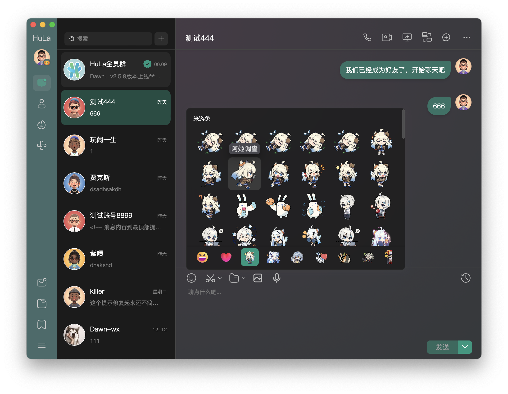

<p align="center">
  
</p>

<p align="center">An instant messaging system built with Tauri, Vite 7, Vue 3, and TypeScript</p>

<!-- 🌟 Featured -->
<div align="center">
  <a href="https://hellogithub.com/repository/743b101346c54f6cb5c20eed2edbaa40" target="_blank">
    
  </a>
</div>

<br>

<!-- Project Statistics & Certification -->
<div align="center">
  <h3>📊 Project Statistics</h3>
  <p>
    <a href="https://gitee.com/HulaSpark/HuLa/stargazers">
      
    </a>
    <a href="https://github.com/HulaSpark/HuLa/stargazers">
      
    </a>
    <a href="https://gitcode.com/HuLaSpark/HuLa">
      
    </a>
  </p>

  <!-- 🔖 Project Certification -->
  <h3>🔖 Project Certification</h3>
  <p>
    <a href="https://deepwiki.com/HuLaSpark/HuLa">
      
    </a>
    <a href="https://app.fossa.com/projects/git%2Bgithub.com%2FHuLaSpark%2FHuLa?ref=badge_shield">
      
    </a>
    <a href="https://www.bestpractices.dev/en/projects/9692">
      
    </a>
  </p>
</div>

<br>

<!-- 🛠️ Tech Stack -->
<div align="center">
  <h3>🛠️ Tech Stack</h3>

  <p>
    
    
    
    
    
    
    
    
  </p>
</div>

<br>

<!-- 🔗 Quick Links -->
<div align="center">
  <h3>🔗 Quick Links</h3>

  <p>
    💻 <strong>Website:</strong><a href="https://hulaspark.com">HuLaSpark</a> |
    📝 <strong>document：</strong><a href="docs\project_guide.md">Configuration and Tutorials</a> |
    ☕️ <strong>Server:</strong><a href="https://github.com/HulaSpark/HuLa-Server">GitHub</a> / <a href="https://gitee.com/HulaSpark/HuLa-Server">Gitee</a> |
    💬 <strong>WeChat:</strong><code>cy2439646234</code>
  </p>
</div>

<p align="center">
  <a href="README.md">中文</a> |
  English |
  <!-- Keep these links. Translations will automatically update with the README. -->
  <a href="https://www.readme-i18n.com/HuLaSpark/HuLa?lang=de">Deutsch</a> |
  <a href="https://www.readme-i18n.com/HuLaSpark/HuLa?lang=es">Español</a> |
  <a href="https://www.readme-i18n.com/HuLaSpark/HuLa?lang=fr">français</a> |
  <a href="https://www.readme-i18n.com/HuLaSpark/HuLa?lang=ja">日本語</a> |
  <a href="https://www.readme-i18n.com/HuLaSpark/HuLa?lang=ko">한국어</a> |
  <a href="https://www.readme-i18n.com/HuLaSpark/HuLa?lang=pt">Português</a> |
  <a href="https://www.readme-i18n.com/HuLaSpark/HuLa?lang=ru">Русский</a>
</p>

## 🌐 Supported Platforms

| Platform | Supported Versions |
|----------|-------------------|
| Windows | Windows 10, Windows 11 |
| macOS | macOS 10.5+ |
| Linux | Ubuntu 22.0+ |
| iOS/iPadOS | iOS 9.0+, iPadOS 9.0+ |
| Android | Android 8.0+ |

## 📝 Project Introduction

HuLa is an instant messaging system built with Tauri, Vite 7, Vue 3, and TypeScript. It leverages Tauri's cross-platform capabilities and Vue 3's reactive design, combined with TypeScript's type safety features and Vite 7's fast build process, providing users with an efficient, secure, and user-friendly communication solution.

## 🛠️ Tech Stack

- **Tauri**: Provides a lightweight, high-performance desktop application container for this project, enabling us to develop cross-platform desktop applications using frontend technology stack. Tauri's design philosophy is to minimize resource consumption while ensuring security.
- **Vite 7**: Vite is a modern frontend build tool that leverages native ES module imports to provide a fast development server, while also offering powerful support for production environment packaging. Vite 7 is its latest version, bringing more optimizations and features.
- **Vue 3**: Vue 3 is a progressive JavaScript framework for building user interfaces. Its Composition API, better TypeScript integration, and mobile optimization make developing complex single-page applications simpler and more efficient.
- **TypeScript**: TypeScript is a superset of JavaScript that adds a type system on top of JavaScript. This allows us to catch more errors during development and provides better editor support.

## 🖼️ Project Preview

<div align="center">
  <h3>🎨 Interface Showcase</h3>
</div>

<!-- Main Interface -->
<table align="center">
  <tr>
    <td align="center">
      
      <br><em>💬 Main Chat Interface</em>
    </td>
    <td align="center">
      
      <br><em>🗨️ Chat Conversation Interface</em>
    </td>
  </tr>
  <tr>
    <td align="center">
      
      <br><em>😊 Emoji Selection</em>
    </td>
    <td align="center">
      
      <br><em>⚙️ System Settings</em>
    </td>
  </tr>
</table>

<br>

<!-- Feature Showcase -->
<div align="center">
  <h4>🌟 Feature Highlights</h4>
</div>

<table align="center">
  <tr>
    <td align="center">
      
      <br><em>📱 Diverse Messaging</em>
    </td>
    <td align="center">
      
      <br><em>🎨 Status Toggle</em>
    </td>
    <td align="center">
      
      <br><em>📷 Image Viewer</em>
    </td>
  </tr>
  <tr>
    <td align="center">
      
      <br><em>👥 Group Management</em>
    </td>
    <td align="center">
      
      <br><em>🤖 ChatBot Plugin Features</em>
    </td>
    <td align="center">
      
      <br><em>🤖 ChatBot Settings Page</em>
    </td>
  </tr>
</table>

## ✨ Features

<div align="center">
  <h3>🎯 Development Progress Overview</h3>
</div>

### 🔐 User Authentication System
| Feature | Description | Status |
|---------|-------------|--------|
| 🔑 | Username/Password Login |  |
| 📱 | QR Code Scan Login |  |
| 💻 | Multi-device Login Management |  |

### 💬 Message Communication
| Feature | Description | Status |
|---------|-------------|--------|
| 👤 | One-on-one Private Chat |  |
| 👥 | Group Chat |  |
| ↩️ | Message Recall |  |
| 📢 | @Mention & Reply Features |  |
| 👁️ | Message Read Status |  |
| 😊 | Emoji Features |  |
| 🖱️ | Message Right-click Menu |  |
| 🔗 | Link Preview Cards |  |
| 👠| Message Like Interaction |  |

### 🤝 Social Management
| Feature | Description | Status |
|---------|-------------|--------|
| â• | Add & Remove Friends |  |
| 🔠| Friend Search |  |
| 🢠| Group Creation & Management |  |
| 🟢 | Friend Online Status |  |
| 🎖️ | Friend Badge System |  |
| 🚫 | Block & Do Not Disturb |  |
| 📤 | Message Forwarding |  |
| 📋 | Group Announcements |  |
| 🏷️ | Nickname & Remark Management |  |

### 🎨 User Experience
| Feature | Description | Status |
|---------|-------------|--------|
| 🖼️ | Modern UI Design |  |
| 🌙 | Dark & Light Theme |  |
| 🭠| Skin Theme Switching |  |

### 🛠️ System Features
| Feature | Description | Status |
|---------|-------------|--------|
| 🪟 | Multi-window Management |  |
| 🔔 | System Tray Notifications |  |
| 📷 | Image Viewer |  |
| ✂️ | Screenshot Feature |  |
| 📠| File Upload (Qiniu Cloud) |  |
| 🔄 | Auto-update System |  |

### 🌐 Cross-platform Support
| Feature | Description | Status |
|---------|-------------|--------|
| 💻 | Windows/macOS/Linux |  |
| 📱 | iOS/Android Adaptation |  |

### 🤖 AI Integration
| Feature | Description | Status |
|---------|-------------|--------|
| 🧠 | AI Chat Assistant |  |
| 🔌 | Multi-platform AI Support |  |

## 👏 Thanks to all Contributors!

<a href="https://github.com/HuLaSpark/HuLa/graphs/contributors">
  
</a>

## 📥 Installation & Running

```bash
# Clone the project
git clone https://gitee.com/HulaSpark/HuLa.git
# or
git clone https://github.com/HulaSpark/HuLa.git

# Enter project directory
cd HuLa

# Install dependencies
pnpm install

# Run development server
pnpm run tauri:dev

# Build for production
pnpm run tauri:build
```

## ⚠️ Important Notes (macOS Users)

Downloading installation packages from the web may show a damaged package prompt, possibly encountering certificate issues due to macOS security mechanisms. Please follow these steps to resolve:

#### 1. Open "System Settings" - "Security & Privacy", check as shown: Allow apps downloaded from "Anywhere" to run:

<div align="center">
  
</div>

#### 2. If errors persist, execute the following commands in Terminal:

```bash
## Execute before installation
sudo xattr -rd com.apple.quarantine path/to/your/downloaded/package
```
```bash
## If already installed, execute the following
sudo xattr -r -d com.apple.quarantine /Applications/ApplicationName.app
```

## 📋 Commit Guidelines

Execute **pnpm run commit** to invoke _git commit_ interaction, complete information input and selection according to prompts.

## ⚖️ Disclaimer

1. This project is provided as an open-source project. Developers do not provide any form of explicit or implicit warranties for the functionality, security, or applicability of the software within the scope permitted by law.
2. Users clearly understand and agree that the risk of using this software is entirely borne by the user. The software is provided on an "as is" and "as available" basis. Developers do not provide any form of warranty, whether explicit or implicit, including but not limited to warranties of merchantability, fitness for a particular purpose, and non-infringement.
3. Under no circumstances shall developers or their suppliers be liable for any direct, indirect, incidental, special, punitive, or consequential damages, including but not limited to profit loss, business interruption, personal information leakage, or other commercial damages or losses arising from the use of this software.
4. All users conducting secondary development on this project must commit to using this software for legal purposes and are responsible for complying with local laws and regulations.
5. Developers have the right to modify the software's functions or features at any time, as well as any part of this disclaimer, and these modifications may be reflected in the form of software updates.

**The final interpretation of this disclaimer belongs to the developers**

## 🎁 Support the Project

<h3>💝 Sponsor Support</h3>
<p><em>If you find HuLa helpful, welcome to sponsor and support us. Your support is our motivation to keep moving forward!</em></p>

<div>
 
  
</div>

<br>

---

## 💬 Join Community

<div align="center">
  <h3>🤝 HuLa Community Discussion Group</h3>
  <p><em>Join developers and users for discussions, get the latest news and technical support</em></p>

  <div>
    
  </div>

  <p><strong>📱 Scan to Join WeChat Discussion Group</strong></p>
</div>

## 🙏 Thanks to Sponsors

<div align="center">
  <h3>💎 Contributors Hall of Fame</h3>
  <p><em>Thanks to the following friends for their generous support of the HuLa project!</em></p>
</div>

### 🏆 Gold Sponsors ($15+)
| 💝 Date | 👤 Sponsor | 💰 Amount | 🏷️ Platform |
|---------|----------|--------|---------|
| 2025-09-03 | **烛火** | `¥500` |  |
| 2025-09-05 | **Orion** | `¥200` |  |
| 2025-08-26 | **唐勇** | `¥200` |  |
| 2025-04-25 | **上官俊斌** | `¥200` |  |
| 2025-05-27 | **临安居士** | `¥188` |  |
| 2025-04-20 | **姜兴(Simon)** | `¥188` |  |
| 2025-02-17 | **禾硕** | `¥168` |  |
| 2025-08-13 | **zhongjing** | `¥100` |  |
| 2025-07-15 | **粉兔** | `¥100` |  |
| 2025-02-8 | **Boom....** | `¥100` |  |

### 🥈 Silver Sponsors ($8-14)
| 💝 Date | 👤 Sponsor | 💰 Amount | 🏷️ Platform |
|---------|----------|--------|---------|
| 2025-06-26 | **m udDy🐖** | `¥88` |  |
| 2025-05-09 | **犹豫，就会败北。** | `¥88` |  |
| 2025-04-01 | **墨** | `¥88.88` |  |
| 2025-02-8 | **邓伟** | `¥88` |  |
| 2025-02-7 | **dennis** | `¥80` |  |
| 2025-02-6 | **小二** | `¥62` |  |
| 2025-05-15 | **孤鸿影** | `¥56` |  |

### 🥉 Bronze Sponsors ($3-7)
| 💝 Date | 👤 Sponsor | 💰 Amount | 🏷️ Platform |
|---------|----------|--------|---------|
| 2025-08-12 | ***持** | `¥20` |  |
| 2025-06-03 | **洪流** | `¥20` |  |
| 2025-05-27 | **刘启成** | `¥20` |  |
| 2025-05-20 | **匿名赞助者** | `¥20` |  |

<div align="center">
  <br>

  > 📝 **Friendly Reminder**
  > This list is manually updated. If you have sponsored but are not listed, please contact us:
  > 🐛 [GitHub Issue](https://github.com/HuLaSpark/HuLa/issues) | 📧 Email: `2439646234@qq.com` | 💬 WeChat: `cy2439646234`

  <br>
</div>

---

## 📄 Open Source License

<div align="center">
  <h3>⚖️ License Information</h3>

  <p>
    <a href="https://app.fossa.com/projects/git%2Bgithub.com%2FHuLaSpark%2FHuLa?ref=badge_large">
      
    </a>
  </p>

  <p><em>This project follows open source license agreements. For detailed information, please check the license report above</em></p>
</div>

---

<div align="center">
  <h3>🌟 Thank You for Your Attention</h3>
  <p>
    <em>If you find HuLa valuable, please give us a ⭐ Star, which is the greatest encouragement for us!</em>
  </p>
  <p>
    <strong>Let's build a better instant messaging experience together 🚀</strong>
  </p>
</div>
