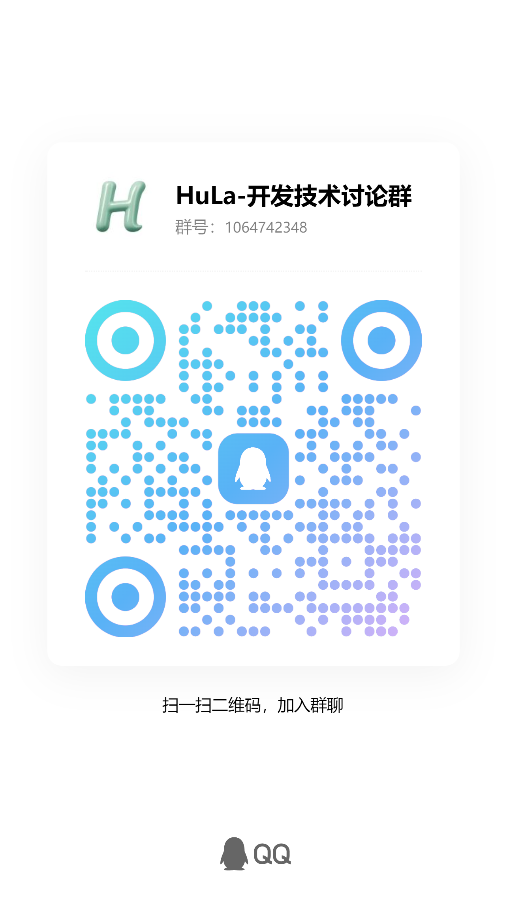

<p align="center">
  
</p>

<p align="center">一款基于Tauri、Vite 7、Vue 3 和 TypeScript 构建的即时通讯系统</p>

<div align="center">
  <a href="https://hellogithub.com/repository/743b101346c54f6cb5c20eed2edbaa40" target="_blank">
    
  </a>
</div>

<br>

<div align="center">
  <p>
    <a href="https://gitee.com/HulaSpark/HuLa/stargazers">
      
    </a>
    <a href="https://github.com/HulaSpark/HuLa/stargazers">
      
    </a>
    <a href="https://gitcode.com/HuLaSpark/HuLa">
      
    </a>
  </p>
</div>

<br>

<div align="center">
  <p>
    <a href="https://deepwiki.com/HuLaSpark/HuLa">
      
    </a>
    <a href="https://app.fossa.com/projects/git%2Bgithub.com%2FHuLaSpark%2FHuLa?ref=badge_shield">
      
    </a>
    <a href="https://www.bestpractices.dev/zh-CN/projects/9692">
      
    </a>
  </p>
</div>

<br>

<!-- 🛠️ 技术栈 -->
<div align="center">
  <p>
    
    
    
    
    
    
    
    
  </p>
</div>

<br>

<!-- 🔗 快速链接 -->
<div align="center">
  <h3>🔗 快速链接</h3>

  <p>
    💻 <strong>官网：</strong><a href="https://hulaspark.com">HuLaSpark</a> |
    📝 <strong>启动文档：</strong><a href="docs/project_guide.md">环境配置及其启动教程</a> |
    ☕️ <strong>服务端：</strong><a href="https://github.com/HulaSpark/HuLa-Server">GitHub</a> / <a href="https://gitee.com/HulaSpark/HuLa-Server">Gitee</a> |
    💬 <strong>微信：</strong><code>cy2439646234</code>
  </p>
</div>

<p align="center">
  中文 |
  <a href="README.en.md">English</a> |
  <!-- Keep these links. Translations will automatically update with the README. -->
  <a href="https://www.readme-i18n.com/HuLaSpark/HuLa?lang=de">Deutsch</a> |
  <a href="https://www.readme-i18n.com/HuLaSpark/HuLa?lang=es">Español</a> |
  <a href="https://www.readme-i18n.com/HuLaSpark/HuLa?lang=fr">français</a> |
  <a href="https://www.readme-i18n.com/HuLaSpark/HuLa?lang=ja">日本語</a> |
  <a href="https://www.readme-i18n.com/HuLaSpark/HuLa?lang=ko">한국어</a> |
  <a href="https://www.readme-i18n.com/HuLaSpark/HuLa?lang=pt">Português</a> |
  <a href="https://www.readme-i18n.com/HuLaSpark/HuLa?lang=ru">Русский</a>
</p>

## 🌐 支持平台

| 平台 | 支持版本 |
|------|---------|
| Windows | Windows 10, Windows 11 |
| macOS | macOS 10.5+ |
| Linux | Ubuntu 22.0+ |
| iOS/iPadOS | iOS 9.0+, iPadOS 9.0+ |
| Android | Android 8.0+ |

## 📝 项目介绍

HuLa 是一款基于 Tauri、Vite 7、Vue 3 和 TypeScript 构建的即时通讯系统。它利用了 Tauri 的跨平台能力和 Vue 3 的响应式设计，结合了 TypeScript 的类型安全特性和 Vite 7 的快速构建，为用户提供了一个高效、安全和易用的通讯解决方案。

## 🛠️ 技术栈

- **Tauri**: 为本项目提供了一款轻量级的、高性能的桌面应用容器，使得我们可以使用前端技术栈来开发跨平台的桌面应用。Tauri 的设计哲学是在保证安全性的前提下，尽可能减少资源占用。
- **Vite 7**: Vite 是一个现代化的前端构建工具，它利用原生 ES 模块导入的能力来提供一个快速的开发服务器，与此同时，它也为生产环境打包提供了强大的支持。Vite 7 是其最新的版本，带来了更多的优化和特性。
- **Vue 3**: Vue 3 是一个渐进式JavaScript框架，用于构建用户界面。它的组合式API、更好的TypeScript集成和对移动端的优化使得开发复杂的单页应用变得更加简单和高效。
- **TypeScript**: TypeScript 是 JavaScript 的一个超集，它在 JavaScript 的基础上增加了类型系统。这让我们能够在开发过程中捕获更多的错误，并且提供更好的编辑器支持。

## 🖼️ 项目预览

<div align="center">
  <h3>🎨 界面展示</h3>
</div>

<!-- 主界面展示 -->
<table align="center">
  <tr>
    <td align="center">
      
      <br><em>💬 主聊天界面</em>
    </td>
    <td align="center">
      
      <br><em>🗨️ 聊天对话界面</em>
    </td>
  </tr>
  <tr>
    <td align="center">
      
      <br><em>😊 表情包选择</em>
    </td>
    <td align="center">
      
      <br><em>⚙️ 系统设置</em>
    </td>
  </tr>
</table>

<br>

<!-- 功能特性展示 -->
<div align="center">
  <h4>🌟 功能特性</h4>
</div>

<table align="center">
  <tr>
    <td align="center">
      
      <br><em>📱 消息多样化</em>
    </td>
    <td align="center">
      
      <br><em>🎨 状态切换</em>
    </td>
    <td align="center">
      
      <br><em> 📷 图片查看</em>
    </td>
  </tr>
  <tr>
    <td align="center">
      
      <br><em>👥 群聊管理</em>
    </td>
    <td align="center">
      
      <br><em>🤖 ChatBot 插件功能</em>
    </td>
    <td align="center">
      
      <br><em>🤖 ChatBot 设置页面</em>
    </td>
  </tr>
</table>

## ✨ 功能特性

<div align="center">
  <h3>🎯 开发进度一览</h3>
</div>


### 🔐 用户认证系统
| 功能 | 描述 | 状态 |
|------|------|------|
| 🔑 | 账号密码登录 |  |
| 📱 | 二维码扫码登录 |  |
| 💻 | 多设备登录管理 |  |

### 💬 消息通信
| 功能 | 描述 | 状态 |
|------|------|------|
| 👤 | 一对一私聊 |  |
| 👥 | 群组聊天 |  |
| ↩️ | 消息撤回 |  |
| 📢 | @提醒、回复功能 |  |
| 👁️ | 消息已读状态 |  |
| 😊 | 表情包功能 |  |
| 🖱️ | 消息右键菜单 |  |
| 🔗 | 链接预览卡片 |  |
| 👍 | 消息点赞互动 |  |
| 📔 | 历史记录管理 |  |

### 🤝 社交管理
| 功能 | 描述 | 状态 |
|------|------|------|
| ➕ | 好友添加与删除 |  |
| 🔍 | 好友搜索 |  |
| 🏢 | 群组创建与管理 |  |
| 🟢 | 好友在线状态 |  |
| 🎖️ | 好友徽章系统 |  |
| 🚫 | 屏蔽拉黑免打扰 |  |
| 📤 | 消息转发 |  |
| 📋 | 群公告功能 |  |
| 🏷️ | 备注昵称管理 |  |
| 📍 | 获取和发送位置 |  |
| 🔥 | 扫码登录、进群 |  |

### 🎨 界面体验
| 功能 | 描述 | 状态 |
|------|------|------|
| 🖼️ | 现代化界面设计 |  |
| 🌙 | 深色浅色主题 |  |
| 🎭 | 皮肤主题切换 |  |

### 🛠️ 系统功能
| 功能 | 描述 | 状态 |
|------|------|------|
| 🪟 | 多窗口管理 |  |
| 🔔 | 系统托盘通知 |  |
| 📷 | 图片查看器 |  |
| ✂️ | 截图功能 |  |
| 📁 | 文件上传(七牛云) |  |
| 🔄 | 自动更新系统 |  |

### 🌐 跨平台支持
| 功能 | 描述 | 状态 |
|------|------|------|
| 💻 | Windows/macOS/Linux |  |
| 📱 | iOS/Android 适配 |  |

### 🤖 AI 集成
| 功能 | 描述 | 状态 |
|------|------|------|
| 🧠 | AI 聊天助手 |  |
| 🔌 | 多平台 AI 支持 |  |

## 👏 感谢以下贡献者们！

<a href="https://github.com/HuLaSpark/HuLa/graphs/contributors">
  
</a>

## 📥 安装与运行

```bash
# 克隆项目
git clone https://gitee.com/HuLaSpark/HuLa.git
或者
git clone https://github.com/HuLaSpark/HuLa.git

# 进入项目目录
cd HuLa

# 安装依赖
pnpm install

# 运行开发服务器
pnpm run tauri:dev

# 构建生产版本
pnpm run tauri:build
```

## ⚠️ 注意事项(macOS用户)

网页上下载安装包会提示安装包已损坏，可能会遇到证书问题，这是因为 macOS 系统的安全机制导致的。请按照以下步骤解决：

#### 1. 打开 "系统设置" - "安全性与隐私"，如图勾选：允许 "任何来源" 下载的 App 运行：

<div align="center">
  
</div>

#### 2. 如果还报错，请在终端执行以下命令解决：

```bash
## 安装前执行
sudo xattr -rd com.apple.quarantine 你的安装包路径/下载的安装包名称
```
```bash
## 如果已经安装，则执行下面
sudo xattr -r -d com.apple.quarantine /Applications/应用名称.app
```

## 📋 提交规范

执行 **pnpm run commit** 唤起 _git commit_ 交互，根据提示完成信息的输入和选择

## ⚖️ 免责声明

1. 本项目是作为一款开源项目提供的，开发者在法律允许的范围内不对软件的功能性、安全性或适用性提供任何形式的明示或暗示的保证
2. 用户明确理解并同意，使用本软件的风险完全由用户自己承担，软件以"现状"和"现有"基础提供。开发者不提供任何形式的担保，无论是明示还是暗示的，包括但不限于适销性、特定用途的适用性和非侵权的担保
3. 在任何情况下，开发者或其供应商都不对任何直接的、间接的、偶然的、特殊的、惩罚性的或后果性的损害承担责任，包括但不限于使用本软件产生的利润损失、业务中断、个人信息泄露或其他商业损害或损失
4. 所有在本项目上进行二次开发的用户，都需承诺将本软件用于合法目的，并自行负责遵守当地的法律和法规
5. 开发者有权在任何时间修改软件的功能或特性，以及本免责声明的任何部分，并且这些修改可能会以软件更新的形式体现

**本免责声明的最终解释权归开发者所有**

## 🎁 支持项目

<h3>💝 赞助支持</h3>
<p><em>如果您觉得 HuLa 对您有帮助，欢迎赞助支持，您的支持是我们不断前进的动力！</em></p>

<div>
 
  
</div>

<br>

---

## 💬 加入社区

<div align="center">
  <h3>🤝 HuLa 社区讨论群</h3>
  <p><em>与开发者和用户一起交流讨论，获取最新资讯和技术支持</em></p>

  <div style="display: flex; justify-content: center; gap: 20px;">
    
    
  </div>
</div>

## 🙏 感谢赞助者

<div align="center">
  <h3>贡献者荣誉榜</h3>
  <p><em>感谢以下朋友对 HuLa 项目的慷慨支持！</em></p>
</div>

### 💎 钻石赞助者 (￥1000+)
| 💝 日期 | 👤 赞助者 | 💰 金额 | 🏷️ 平台 |
|---------|----------|--------|---------|
| 2025-09-12 | **翟可** | `¥1688` |  |

### 🏆 金牌赞助者 (￥100+)
| 💝 日期 | 👤 赞助者 | 💰 金额 | 🏷️ 平台 |
|---------|----------|--------|---------|
| 2025-09-03 | **烛火** | `¥500` |  |
| 2025-09-05 | **Orion** | `¥200` |  |
| 2025-10-24 | **唐勇（伏威）** | `¥200` |  |
| 2025-08-26 | **唐勇** | `¥200` |  |
| 2025-04-25 | **上官俊斌** | `¥200` |  |
| 2025-05-27 | **临安居士** | `¥188` |  |
| 2025-04-20 | **姜兴(Simon)** | `¥188` |  |
| 2025-02-17 | **禾硕** | `¥168` |  |
| 2025-10-16 | **xx豪** | `¥101` |  |
| 2025-10-15 | **兵** | `¥100` |  |
| 2025-08-13 | **zhongjing** | `¥100` |  |
| 2025-07-15 | **粉兔** | `¥100` |  |
| 2025-02-8 | **Boom....** | `¥100` |  |

### 🥈 银牌赞助者 (￥50-99)
| 💝 日期 | 👤 赞助者 | 💰 金额 | 🏷️ 平台 |
|---------|----------|--------|---------|
| 2025-06-26 | **m udDy🐖** | `¥88` |  |
| 2025-05-09 | **犹豫，就会败北。** | `¥88` |  |
| 2025-04-01 | **墨** | `¥88.88` |  |
| 2025-02-8 | **邓伟** | `¥88` |  |
| 2025-02-7 | **dennis** | `¥80` |  |
| 2025-02-6 | **小二** | `¥62` |  |
| 2025-05-15 | **孤鸿影** | `¥56` |  |

### 🥉 铜牌赞助者 (￥20-49)
| 💝 日期 | 👤 赞助者 | 💰 金额 | 🏷️ 平台 |
|---------|----------|--------|---------|
| 2025-08-12 | ***持** | `¥20` |  |
| 2025-06-03 | **洪流** | `¥20` |  |
| 2025-05-27 | **刘启成** | `¥20` |  |
| 2025-05-20 | **匿名赞助者** | `¥20` |  |

<div align="center">
  <br>

  > 📝 **温馨提示**
  > 该名单为手动更新，如果您已赞助但未在列表中，请联系我们：
  > 🐛 [GitHub Issue](https://github.com/HuLaSpark/HuLa/issues) | 📧 邮箱: `2439646234@qq.com` | 💬 微信: `cy2439646234`

  <br>
</div>

---

## 📄 开源许可

<div align="center">
  <h3>⚖️ 许可证信息</h3>

  <p>
    <a href="https://app.fossa.com/projects/git%2Bgithub.com%2FHuLaSpark%2FHuLa?ref=badge_large">
      
    </a>
  </p>

  <p><em>本项目遵循开源许可协议，详细信息请查看上方许可证报告</em></p>
</div>

---

<div align="center">
  <h3>🌟 感谢您的关注</h3>
  <p>
    <em>如果您觉得 HuLa 有价值，请给我们一个 ⭐ Star，这是对我们最大的鼓励！</em>
  </p>
  <p>
    <strong>让我们一起构建更好的即时通讯体验 🚀</strong>
  </p>
</div>
