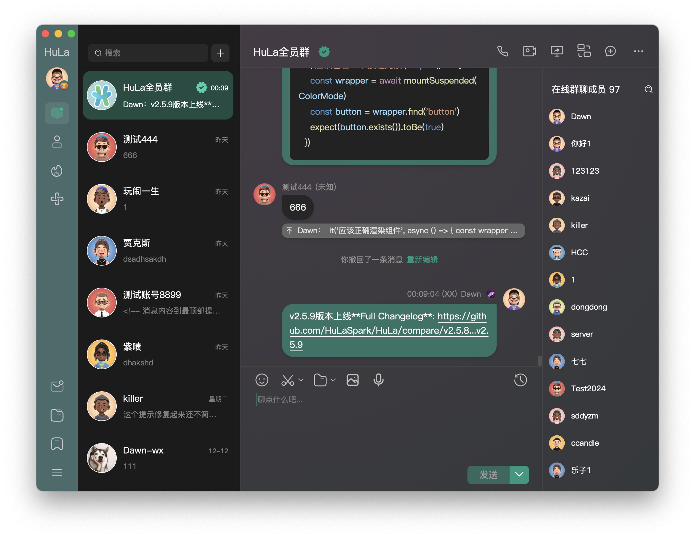
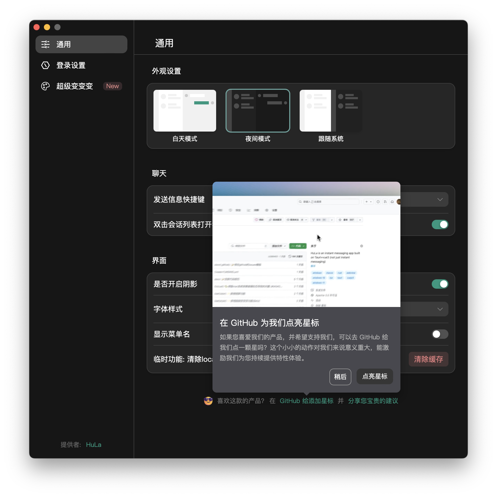
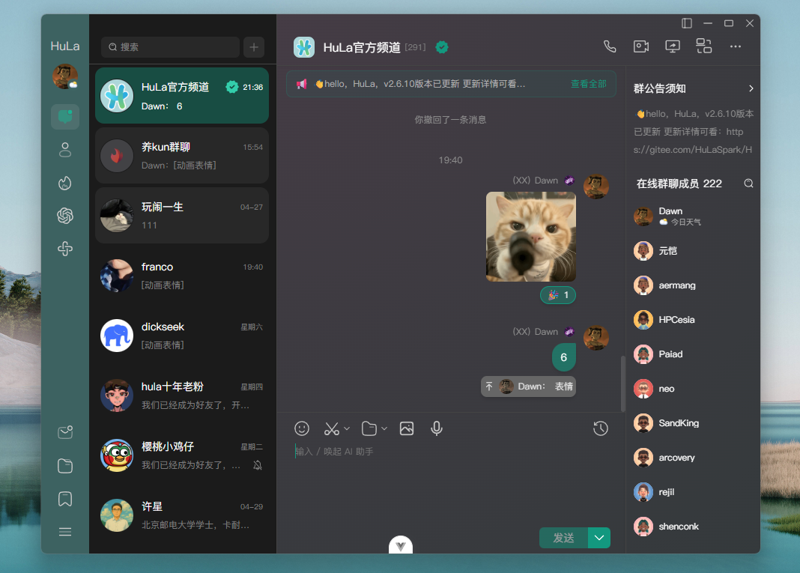
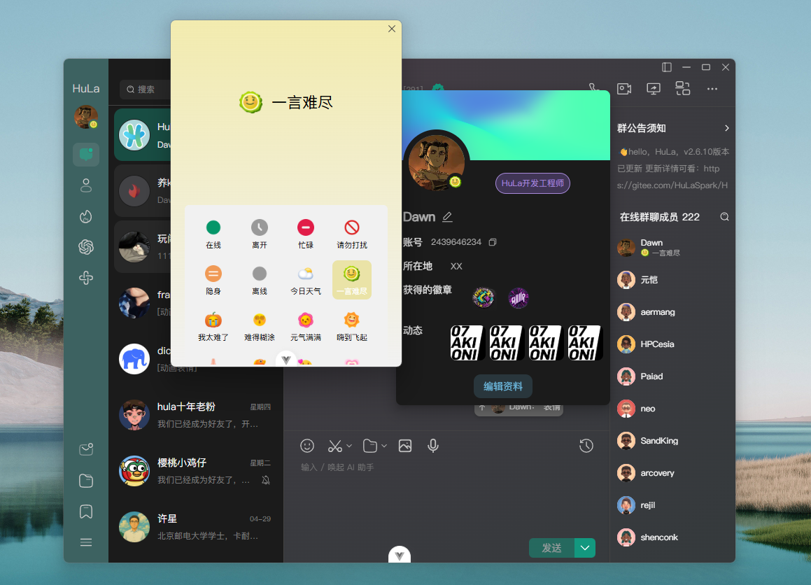
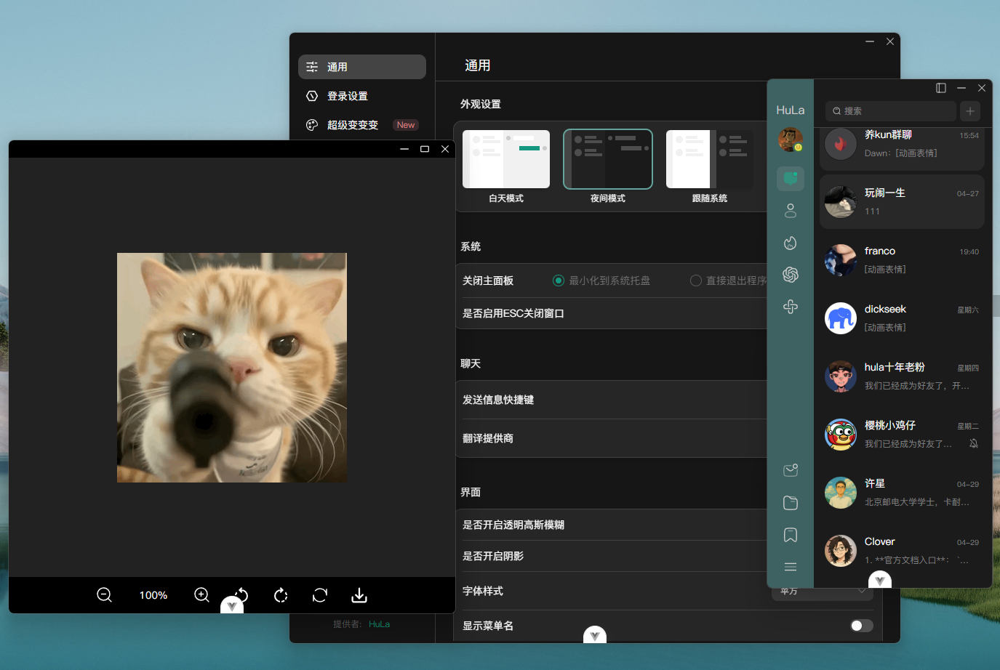
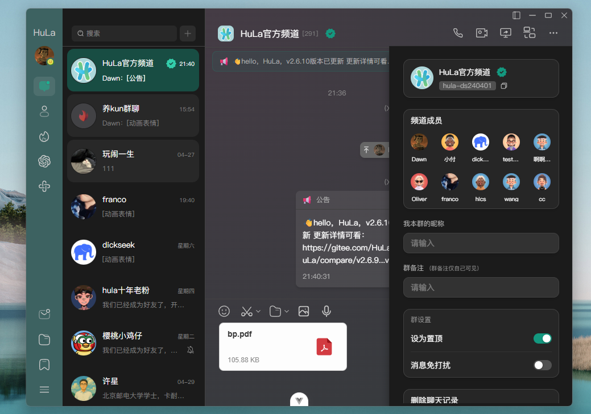
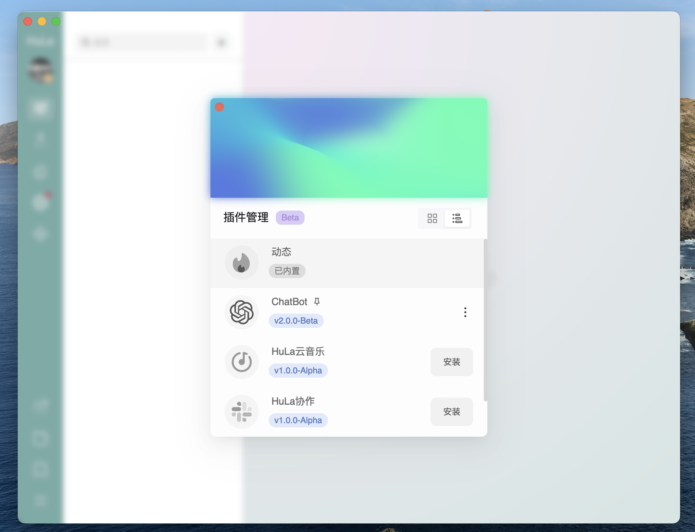
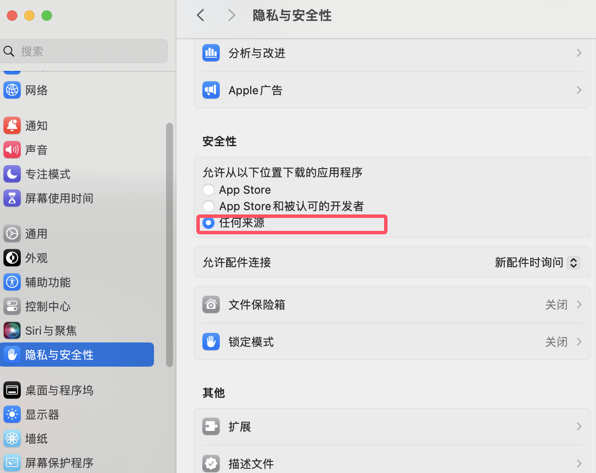
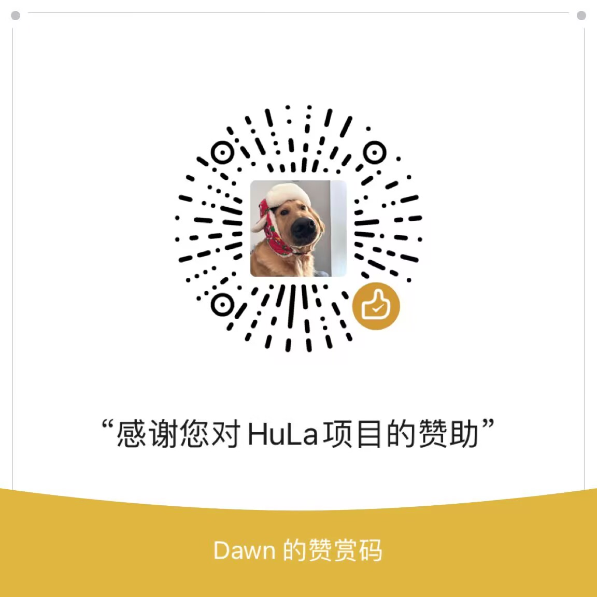

<p align="center">
  
</p>

<p align="center">一款基于Tauri、Vite 6、Vue 3 和 TypeScript 构建的即时通讯系统</p>

<div align="center">
  <a href="https://hellogithub.com/repository/743b101346c54f6cb5c20eed2edbaa40" target="_blank"></a>
</div>

<div align="center">
  <a href="https://deepwiki.com/HuLaSpark/HuLa"></a>
  <a href="https://app.fossa.com/projects/git%2Bgithub.com%2FHuLaSpark%2FHuLa?ref=badge_shield"></a>
  <a href="https://www.bestpractices.dev/zh-CN/projects/9692"></a>
  
  
  
  
  
  
  
  
</div>

<p align="center">
  gitee：<a href="https://gitee.com/HulaSpark/HuLa/stargazers"></a>
  github：<a href="https://gitee.com/link?target=https://github.com/HulaSpark/HuLa/stargazers"></a>
  gitcode：<a href="https://gitcode.com/HuLaSpark/HuLa"></a>
</p>
<p align="center">
  微信: 
</p>

<p align="center">
  💻 官网：<a href="https://hulaspark.com">HuLaSpark</a>
</p>

<p align="center">
  ☕️ 服务端：<a href="https://github.com/HulaSpark/HuLa-Server">github HuLa-Server</a> | <a href="https://gitee.com/HulaSpark/HuLa-Server">gitee HuLa-Server</a>
</p>

<p align="center">
  中文 | 
  <a href="README.en.md">English</a> | 
  <!-- Keep these links. Translations will automatically update with the README. -->
  <a href="https://www.readme-i18n.com/HuLaSpark/HuLa?lang=de">Deutsch</a> | 
  <a href="https://www.readme-i18n.com/HuLaSpark/HuLa?lang=es">Español</a> | 
  <a href="https://www.readme-i18n.com/HuLaSpark/HuLa?lang=fr">français</a> | 
  <a href="https://www.readme-i18n.com/HuLaSpark/HuLa?lang=ja">日本語</a> | 
  <a href="https://www.readme-i18n.com/HuLaSpark/HuLa?lang=ko">한국어</a> | 
  <a href="https://www.readme-i18n.com/HuLaSpark/HuLa?lang=pt">Português</a> | 
  <a href="https://www.readme-i18n.com/HuLaSpark/HuLa?lang=ru">Русский</a>
</p>

## 🌐 支持平台

| 平台 | 支持版本 |
|------|---------|
| Windows | Windows 10, Windows 11 |
| macOS | macOS 10.5+ |
| Linux | Ubuntu 22.0+ |
| iOS/iPadOS | iOS 9.0+, iPadOS 9.0+ |
| Android | Android 8.0+ |

## 📝 项目介绍

HuLa 是一款基于 Tauri、Vite 6、Vue 3 和 TypeScript 构建的即时通讯系统。它利用了 Tauri 的跨平台能力和 Vue 3 的响应式设计，结合了 TypeScript 的类型安全特性和 Vite 6 的快速构建，为用户提供了一个高效、安全和易用的通讯解决方案。

## 🛠️ 技术栈

- **Tauri**: 为本项目提供了一款轻量级的、高性能的桌面应用容器，使得我们可以使用前端技术栈来开发跨平台的桌面应用。Tauri 的设计哲学是在保证安全性的前提下，尽可能减少资源占用。
- **Vite 6**: Vite 是一个现代化的前端构建工具，它利用原生 ES 模块导入的能力来提供一个快速的开发服务器，与此同时，它也为生产环境打包提供了强大的支持。Vite 6 是其最新的版本，带来了更多的优化和特性。
- **Vue 3**: Vue 3 是一个渐进式JavaScript框架，用于构建用户界面。它的组合式API、更好的TypeScript集成和对移动端的优化使得开发复杂的单页应用变得更加简单和高效。
- **TypeScript**: TypeScript 是 JavaScript 的一个超集，它在 JavaScript 的基础上增加了类型系统。这让我们能够在开发过程中捕获更多的错误，并且提供更好的编辑器支持。

## 🖼️ 项目预览







<div style="padding: 28px; display: inline-block;">
  
</div>

<div style="padding: 28px; display: inline-block;">
  
</div>

<div style="padding: 28px; display: inline-block;">
  
</div>

<div style="padding: 28px; display: inline-block;">
  
</div>

<div style="padding: 28px; display: inline-block;">
  
</div>

<div style="padding: 28px; display: inline-block;">
  
</div>

## ✨ 已完成功能

| 功能分类 | 功能描述 | 状态 |
|---------|---------|------|
| 🔐 **用户认证** | 账号密码登录 | ✅ 已完成 |
| | 二维码扫码登录 | ✅ 已完成 |
| | 多设备登录管理 | ✅ 已完成 |
| 💬 **消息功能** | 一对一私聊 | ✅ 已完成 |
| | 群组聊天 | ✅ 已完成 |
| | 消息撤回 | ✅ 已完成 |
| | @提醒、回复功能 | ✅ 已完成 |
| | 消息已读状态 | ✅ 已完成 |
| | 表情包功能 | ✅ 已完成 |
| | 根据消息类型右键菜单 | ✅ 已完成 |
| | 支持解析链接为预览卡片 | ✅ 已完成 |
| | 消息点赞和不满状态 | ✅ 已完成 |
| 👥 **联系人、群聊管理** | 好友添加与删除 | ✅ 已完成 |
| | 好友搜索 | ✅ 已完成 |
| | 群组创建与管理 | ✅ 已完成 |
| | 好友在线状态 | ✅ 已完成 |
| | 好友徽章 | ✅ 已完成 |
| | 屏蔽、拉黑、免打扰功能 | ✅ 已完成 |
| | 消息逐条\合并转发 | 🚧 进行中 |
| | 群公告 | ✅ 已完成 |
| | 群聊、单聊备注、昵称等 | ✅ 已完成 |
| 🎨 **UI界面** | 现代化界面设计 | ✅ 已完成 |
| | 深色/浅色主题支持 | ✅ 已完成 |
| | 皮肤主题切换 | ✅ 已完成 |
| 🛠️ **系统功能** | 多窗口管理 | ✅ 已完成 |
| | 系统托盘、托盘闪烁提醒支持 | ✅ 已完成 |
| | 消息通知 | ✅ 已完成 |
| | 图片查看器 | ✅ 已完成 |
| | 截图功能 | 🚧 进行中 |
| | 文件上传（支持七牛云存储） | ✅ 已完成 |
| | 支持自动、强制更新 | ✅ 已完成 |
| | 自定义更新页面 | ✅ 已完成 |
| 🌐 **跨平台支持** | win10、win11/macOS/linux | ✅ 已完成 |
| | iOS/Android适配 | 🚧 进行中 |
| 🤖 **AI** | deepseek、chatgpt、claude、qwen、自定义 | 🚧 进行中 |

## 👏 感谢以下贡献者们！

<a href="https://github.com/HuLaSpark/HuLa/graphs/contributors">
  
</a>

## 📥 安装与运行

```bash
# 克隆项目
git clone https://gitee.com/HuLaSpark/HuLa.git
或者
git clone https://github.com/HuLaSpark/HuLa.git

# 进入项目目录
cd HuLa

# 安装依赖
pnpm install

# 运行开发服务器
pnpm run tauri:dev

# 构建生产版本
pnpm run tauri:build
```

## ⚠️ 注意事项(macOS用户)

网页上下载安装包会提示安装包已损坏，可能会遇到证书问题，这是因为 macOS 系统的安全机制导致的。请按照以下步骤解决：

#### 1. 打开 "系统设置" - "安全性与隐私"，如图勾选：允许 "任何来源" 下载的 App 运行：

<div style="padding: 28px; display: inline-block;">
  
</div>

#### 2. 如果还报错，请在终端执行以下命令解决：

```bash
## 安装前执行
sudo xattr -rd com.apple.quarantine 你的安装包路径/下载的安装包名称
```
```bash
## 如果已经安装，则执行下面
sudo xattr -r -d com.apple.quarantine /Applications/应用名称.app
```

## 📋 提交规范

执行 **pnpm run commit** 唤起 _git commit_ 交互，根据提示完成信息的输入和选择

## ⚖️ 免责声明

1. 本项目是作为一款开源项目提供的，开发者在法律允许的范围内不对软件的功能性、安全性或适用性提供任何形式的明示或暗示的保证
2. 用户明确理解并同意，使用本软件的风险完全由用户自己承担，软件以"现状"和"现有"基础提供。开发者不提供任何形式的担保，无论是明示还是暗示的，包括但不限于适销性、特定用途的适用性和非侵权的担保
3. 在任何情况下，开发者或其供应商都不对任何直接的、间接的、偶然的、特殊的、惩罚性的或后果性的损害承担责任，包括但不限于使用本软件产生的利润损失、业务中断、个人信息泄露或其他商业损害或损失
4. 所有在本项目上进行二次开发的用户，都需承诺将本软件用于合法目的，并自行负责遵守当地的法律和法规
5. 开发者有权在任何时间修改软件的功能或特性，以及本免责声明的任何部分，并且这些修改可能会以软件更新的形式体现

**本免责声明的最终解释权归开发者所有**

## 🎁 赞助HuLa
如果您觉得HuLa对您有帮助，欢迎赞助HuLa，您的支持是我们不断前进的动力

<div style="display: flex;">



</div>

## 💬 HuLa社区讨论群


## 🙏 赞助者名单
感谢以下赞助者的支持！

| 日期 | 赞助者 | 金额 | 平台 |
|------|--------|------|------|
| 2025-04-25 | 上官俊斌 | ￥200 | 微信赞赏码 |
| 2025-05-27 | 临安居士 | ￥188 | 微信赞赏码 |
| 2025-04-20 | 姜兴(Simon) | ￥188 | 微信赞赏码 |
| 2025-02-17 | 禾硕 | ￥168 | 支付宝赞赏 |
| 2025-02-8 | Boom.... | ￥100 | 微信赞赏码 |
| 2025-06-26 | m udDy🐖 | ￥88 | 微信赞赏码 |
| 2025-05-09 | 犹豫，就会败北。| ￥88.00 | 微信红包 |
| 2025-04-01 | 墨       | ￥88.88 | 微信转账 |
| 2025-02-8 | 邓伟 | ￥88 | 微信赞赏码 |
| 2025-02-7 | dennis | ￥80 | gitee码云赞赏 |
| 2025-05-15 | 孤鸿影 | ￥56 | 微信红包 |
| 2025-02-6 | 小二 | ￥62 | 微信转账 |
| 2025-06-03 | 洪流 | ￥20 | 微信赞赏码 |
| 2025-05-27 | 刘启成 | ￥20 | 微信赞赏码 |
| 2025-05-20 | 没有留名的赞助者 | ￥20 | 微信赞赏码 |

> 注：该名单为手动更新。如果您已赞助但未显示在列表中，请通过以下方式联系我们：
 1. 在GitHub上提交Issue
 2. 发送邮件至: 2439646234@qq.com
 3. 通过微信联系: cy2439646234

## 📄 许可证
[](https://app.fossa.com/projects/git%2Bgithub.com%2FHuLaSpark%2FHuLa?ref=badge_large)
