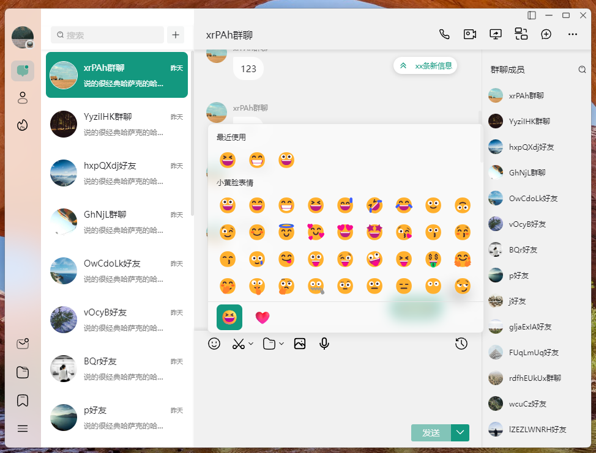

<p align="center">
  
</p>

<p align="center">An Instant Messaging System Built with Tauri, Vite 5, Vue 3, and TypeScript</p>

<div align="center">
  
  
  
  
  
  
  
  
  
</div>

<p align="center">
  gitee：<a target="_blank" href="https://gitee.com/nongyehong/HuLa-IM-Tauri" title="HuLa"></a>
  github：<a target="_blank" href="https://github.com/nongyehong/HuLa-IM-Tauri" title="HuLa"></a>
</p>
<p align="center">
  WeChat: 
</p>

<p align="center"><a href="README.zh-CN.md">中文</a> | English</p>

## Project Introduction

HuLa is an instant messaging system developed with Tauri, Vite 5, Vue 3, and TypeScript. It leverages the cross-platform capabilities of Tauri and the reactive design of Vue 3, combined with TypeScript's type safety features and the fast build system of Vite 5, to provide users with an efficient, secure, and easy-to-use communication solution.

## Technology Stack

- **Tauri**: Provides a lightweight, high-performance desktop application container, enabling the development of cross-platform desktop applications with a web technology stack. Tauri's design philosophy aims to minimize resource consumption while ensuring security.
- **Vite 5**: A modern front-end build tool that uses native ES module import to offer a fast development server. At the same time, it provides robust support for production builds. Vite 5 is its latest version, bringing more optimizations and features.
- **Vue 3**: A progressive JavaScript framework for building user interfaces. Its Composition API, improved TypeScript integration, and optimizations for mobile platforms make developing complex single-page applications simpler and more efficient.
- **TypeScript**: A superset of JavaScript that adds a type system to the language. It enables catching more errors during development and provides better support from editors.

## Project PreView




HuLa adopts a modular architecture design, with the front end built using Vue 3 for the user interface, enhanced by TypeScript for better code readability and maintainability. On the backend, we use the Tauri framework for packaging and distributing the application, leveraging its native integration with the operating system to offer users more functionality and higher performance.

## Installation and Running

```bash
# Clone the project
git clone https://gitee.com/nongyehong/HuLa-IM-Tauri.git
or
git clone https://github.com/nongyehong/HuLa-IM-Tauri.git

# Enter the project directory
cd HuLa

# Install dependencies
pnpm install

# Run the development server
pnpm run tauri:dev

# Build for production
pnpm run tauri:build
```

## SubmissionSpecification
use **pnpm run commit** to invoke the _git commit_ interaction and follow the prompts to complete the input and selection of information
